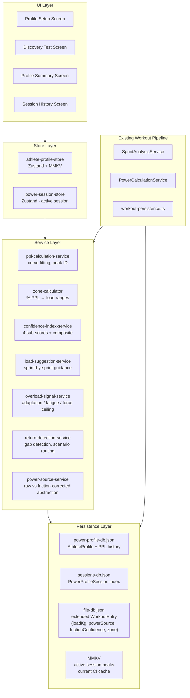

# DRIVE Power Profile Framework — Implementation Plan

> Version 2.0 · April 2026
> Based on [DRIVE_Power_Profile_Framework_v2.md](../../Downloads/DRIVE_Power_Profile_Framework_v2.md)

---

## Overview

Implement the DRIVE Power Profile Framework (PPL) into the app in 6 phases — from data model foundations through PPL calculation, session grouping, confidence index, and full profile dashboard UI — following the feature-based architecture in [claude.md](../claude.md).

---

## Architecture Overview

All new code lives under `src/features/power-profile/` per the target structure in `claude.md`. The feature owns its own types, services, store, hooks, components, and screens. Thin route files wire screens in `src/app/(app)/`.



---

## Peak Data Hierarchy

| Level                | Entity                | What Is Stored                                                                                                             | Where                                     |
| -------------------- | --------------------- | -------------------------------------------------------------------------------------------------------------------------- | ----------------------------------------- |
| Sprint               | `SprintPowerRecord`   | peakPower, **powerSource** ('raw' today), loadKg, frictionConfidence ('Unknown' today), pplAtTimeOfSprint, zoneAtRecording | Extended `WorkoutEntry` in `file-db.json` |
| Session              | `PowerProfileSession` | sessionId, sprintIds, sessionPeakPower, sessionPPLEstimate, CI snapshot, load range covered                                | `sessions-db.json`                        |
| Profile / Historical | `AthleteProfile`      | currentPPL, historicalPeakPower, pplHistory[], FV classification, historyDepthMonths, lastUpdated                          | `power-profile-db.json`                   |
| Live / Active        | Session Zustand store | in-progress sprint results, curve shape, current load suggestion                                                           | MMKV-backed Zustand                       |

---

## Minimum User Input

Only **athlete name** is strictly required to create a profile and begin training or run a Discovery Test. Body weight is optional but strongly recommended.

| Field                | Required | Impact if omitted                                                                                          |
| -------------------- | -------- | ---------------------------------------------------------------------------------------------------------- |
| **Athlete name**     | Yes      | Profile cannot be created without an identifier                                                            |
| **Body weight (kg)** | No       | BW-relative load guidance and discovery sprint table are unavailable; absolute load suggestions still work |

Sled mass is already collected per-sprint in the existing `SledMassTile` / `useCalculationConfigStore` flow.

### Body Weight — Optional but Recommended

- The app guides the athlete through the Discovery Test and training with or without body weight.
- Without BW, load suggestions are based on **absolute power curve shape only** (ascending/peak/descending limb detection still works). The BW-relative load table (e.g. "Sprint 1 at ~20% BW") is shown as a recommendation prompt, not a gate.
- The profile setup screen displays a non-blocking prompt: _"Add your body weight to get personalised load targets and track your PPL as % of bodyweight."_
- If BW is added later, the profile retrospectively computes `PPL as % BW` for all stored PPL revisions.
- The `bodyWeightKg` field on `AthleteProfile` is `number | null`. All services that use it must handle the null case gracefully and fall back to absolute-load logic.

---

## Power Source Abstraction — Friction Detection Strategy

### Current State

Friction detection capability in the app is **unvalidated**. The framework document specifies "friction-corrected peak power" (`peak_power_true`) as the canonical input for PPL calculations and the CI Peak Zone Density quality filter. Until friction detection is confirmed to work reliably, using it would introduce systematic error into every PPL estimate.

**For now:** all PPL calculations and CI sub-scores use the **existing `power_magnitude` channel** from `ProcessedSensorData` — specifically `peakPower` as already captured in `WorkoutMetrics`. No friction correction is applied.

### The Abstraction

A thin `power-source-service.ts` is introduced in Phase 1 to isolate the power channel selection from all consumers:

```ts
type PowerSource = 'raw' | 'friction_corrected';

function getSprintPeakPower(
  metrics: WorkoutMetrics,
  source: PowerSource
): number;
```

- `'raw'` → reads `metrics.peakPower` (existing `power_magnitude` channel). **This is the only active branch today.**
- `'friction_corrected'` → will read a future `metrics.peakPowerTrue` field populated by a validated friction detection pipeline. **Branch is defined but throws `'not yet implemented'` until enabled.**

A single feature flag `POWER_SOURCE: PowerSource = 'raw'` lives in `src/features/power-profile/constants.ts`. Switching to friction-corrected power in the future is a one-line change, affecting all consumers uniformly.

### `powerSource` Field on Sprint Records

Every `SprintPowerRecord` stores `powerSource: PowerSource` alongside the peak power value. This ensures:

- Historical sprint records remain interpretable when the source switches — you always know what method produced each data point.
- CI calculations can be scoped to a single source if mixed data exists during a transition period.

### `frictionConfidence` Field — Stored Now, Active When Validated

`frictionConfidence: 'Unknown' | 'Low' | 'Medium' | 'High'` is included in `SprintPowerRecord` and set to `'Unknown'` by default. The field is persisted from day one so historical records are enrichable later without a data migration.

**CI Peak Zone Density operates in two modes:**

1. **Raw power mode (today)** — Sprint count near PPL is the only criterion. All sprints within ±10% PPL are counted. The CI is fully functional; it accurately reflects how much direct PPL-zone evidence has accumulated regardless of friction correction. This is the default.

2. **Friction-corrected mode (future)** — Once friction detection is validated, `frictionConfidence` becomes an additional quality gate on top of the sprint count. Sprints with `frictionConfidence = 'Unknown' | 'Low'` are excluded from Peak Zone Density but still contribute to Curve Coverage. The `qualityFilter` parameter makes this switchable without changing call sites:

```ts
calculatePeakZoneDensity(
  sessions,
  pplEstimate,
  windowDays = 90,
  qualityFilter: 'none' | 'friction_confidence' = 'none'  // flip when friction detection is validated
)
```

**Transition behaviour when friction detection is enabled:** the app does not discard existing raw-power data. Sprints recorded before friction detection was activated keep `powerSource = 'raw'` and `frictionConfidence = 'Unknown'`. They continue to count toward Curve Coverage. New sprints accumulate with real `frictionConfidence` values and gradually build up Peak Zone Density under the stricter gate. The CI rebuilds accurately as the new data accumulates — no profile reset is required.

### When Friction Detection Is Ready

**Code changes:**

1. Implement and validate the friction detection pipeline in the sensor processing layer (out of scope for this feature).
2. Populate `WorkoutMetrics.peakPowerTrue` and `frictionConfidence` from the new pipeline.
3. Set `POWER_SOURCE = 'friction_corrected'` in `constants.ts`.
4. Set the `qualityFilter` default to `'friction_confidence'` in `calculatePeakZoneDensity`.
5. No other changes needed — all consumers read through the abstraction. Existing data is preserved and remains valid for Curve Coverage.

**Athlete experience at activation:**

When friction detection is enabled (app update), the athlete's profile CI will likely drop — existing raw-power sprints no longer count toward Peak Zone Density under the stricter quality gate, even though they remain valid for Curve Coverage. The app handles this in one of two ways, and the athlete chooses:

- **Gradual rebuild** — continue training normally. Each new sprint records a real `frictionConfidence` value and begins accumulating Peak Zone Density under the new gate. CI rebuilds over several sessions without any explicit test.
- **Immediate retest** — the app surfaces a one-time prompt at activation: _"Friction detection is now active. Run a quick Peak Power Test to update your profile with friction-corrected data."_ This navigates to `discovery-test.tsx` in `'targeted_retest'` mode. One or two sprints at PPL load are enough to re-establish Peak Zone Density and restore CI to ESTABLISHED within a single session.

The prompt is shown once, is dismissible, and does not block training. If dismissed, the gradual path applies. This prompt is driven by a `frictionActivationAcknowledged: boolean` flag on `AthleteProfile` — set to `true` either when the retest is completed or when the prompt is dismissed.

---

## Phase 1 — Data Foundation & Athlete Profile

**Goal:** establish the type system, persistence layer, and minimum-input profile creation.

**New folder:** `src/features/power-profile/`

### Types (`types/`)

- `power-source.ts` — `PowerSource = 'raw' | 'friction_corrected'`
- `athlete-profile.ts` — `AthleteProfile` (`bodyWeightKg: number | null`, `frictionActivationAcknowledged: boolean`, `incompleteDiscoverySessionId: string | null`, `historicalPeakPower: number | null`, `historicalPeakPowerLoad: number | null`), `PPLRevision` (includes `pplAsPctBW: number | null`, `ambiguousPeak: boolean`), `FVClassification` enum, `HistoryDepth` enum
- `sprint-power-record.ts` — extends `WorkoutMetrics` with `athleteId: string | null`, `loadKg`, `peakVelocity: number` (m/s — stored for F-V chart plotting), `powerSource: PowerSource`, `frictionConfidence: 'Unknown' | 'Low' | 'Medium' | 'High'` (stored, defaulting to `'Unknown'`), `pplAtTimeOfSprint`, `zoneAtRecording`, `returnDetectionFlag`
- `power-session.ts` — `PowerProfileSession` (sessionId, `athleteId: string | null`, sprintIds[], sessionPeakPower, sessionPPLEstimate, ciSnapshot, startedAt, completedAt, `testStatus: 'complete' | 'incomplete' | 'not_a_test'`, `testMode: 'discovery' | 'targeted_retest' | null`)
- `confidence-index.ts` — `CISubScores`, `CIBadge`, `CIThreshold` enum
- `training-zones.ts` — `TrainingZone` enum (SPEED_STRENGTH, PEAK_POWER, STRENGTH_SPEED, OVERLOAD), `ZonePrescription`
- `sprint-metric.ts` — `SprintMetric` (`id`, `label`, `value`, `unit`, `source`) — the extensible tile config type for sprint detail screen

### Constants

- `src/features/power-profile/constants.ts` — `POWER_SOURCE: PowerSource = 'raw'` (single flag controlling the active power channel across all services)

### Services (`services/`)

- `power-source-service.ts` — `getSprintPeakPower(metrics, source)` abstraction; `'raw'` branch active, `'friction_corrected'` branch defined but throws until implemented
- `power-profile-persistence.ts` — read/write `power-profile-db.json` and `sessions-db.json` via `expo-file-system` (same pattern as existing `workout-persistence.ts`); includes `getUnattachedSprints()`, `assignSprintToAthlete(sprintId, athleteId)`, `getSessionsInWindow(athleteId, days)`

### Extend existing types

- `src/types/workout-database.ts` — add `athleteId?: string | null`, `loadKg?`, `peakVelocity?`, `frictionConfidence?`, `pplAtTimeOfSprint?`, `zoneAtRecording?`, `sessionId?`, `powerSource?` to `WorkoutMetrics` / `WorkoutEntry`

### Store (`store/`)

- `athlete-profile-store.ts` — Zustand + MMKV persist; holds `AthleteProfile[]`, `activeAthleteId`, CRUD actions
- `power-session-store.ts` — Zustand + MMKV persist; sprint results, current load suggestion, curve data, `targetZone: TrainingZone | null`, `loadSuggestionsEnabled: boolean`, `sessionMode: 'training' | 'discovery' | 'targeted_retest'`, `resumingSessionId: string | null`, `historicalPBBeatenThisSession: boolean`, `interruptedAt: number | null`, `endedAt: number | null`; cleared on clean `endSession()` or `discardSession()`

### Screen

- `screens/athlete-profile-setup.screen.tsx` — TanStack Form + Zod; required field: name (string); optional field: bodyWeight (number, kg) with inline prompt explaining its benefit; creates `AthleteProfile` with empty PPL history
- Route: `src/app/(app)/profile-setup.tsx`

---

## Phase 2 — PPL Calculation Engine & Load Suggestion

**Goal:** core math services that take sprint results and produce PPL, F-V classification, zones, and next-load suggestions.

### Services (`services/`)

- `ppl-calculation-service.ts` — curve fit (polynomial or parabolic) across load-power points; identifies PPL load and peak power; produces `PPLRevision`. Reads power values via `power-source-service.getSprintPeakPower()` — insulated from the friction-corrected channel entirely.
- `fv-classification-service.ts` — compute load-velocity slope across discovery sprints; classify as Force-Dominant / Balanced / Velocity-Dominant
- `zone-calculator-service.ts` — given PPL, compute load ranges for all four zones; returns `ZonePrescription`. Exposes `classifyLoad(loadKg, ppl): TrainingZone` used at sprint-save time to stamp `zoneAtRecording` once. Zone classification is immutable after save.
- `load-suggestion-service.ts` — sprint-by-sprint guidance logic with two operating modes:
  - **Discovery mode** — ascending/peak/descending limb detection; maps power delta % to next load increment to find PPL; ignores target zone setting.
  - **Training mode** — suggestions stay within the athlete's selected training zone. If the user has set a target zone (e.g. STRENGTH_SPEED), next-load suggestions remain within that zone's load range derived from their current PPL. Falls back to PPL-zone suggestions if no zone is selected.
  - Returns `{ nextLoadKg, rationale, zone }` and human-readable message. Reads power via the abstraction.
  - Load suggestions can be toggled off entirely via `loadSuggestionsEnabled: boolean` on `power-session-store`. When off, the service is not called and no suggestion tile is shown.

### Training Zone & Load Suggestion Settings

- `power-session-store.ts` includes `targetZone: TrainingZone | null` and `loadSuggestionsEnabled: boolean`.
- Before starting a session (or from a settings panel within the session), the user can:
  - Select a target training zone (SPEED_STRENGTH, PEAK_POWER, STRENGTH_SPEED, OVERLOAD, or none).
  - Toggle load suggestions on or off.
- When a zone is selected, the `load-suggestion-tile` shows only loads within that zone's range and labels them accordingly (e.g. "Strength-Speed zone: try 72 kg").
- When suggestions are off, no tile is rendered; the athlete loads whatever they choose, and the sprint is still recorded and attributed to whichever zone its load falls in.

### Integration

- Extend the existing sprint save flow (`use-workout-actions.ts`) to capture `loadKg` from `useCalculationConfigStore` and write to `WorkoutEntry` with new fields. Set `powerSource = POWER_SOURCE` and `frictionConfidence = 'Unknown'` at save time.
- `load-suggestion-service` is called immediately after each sprint save only when `loadSuggestionsEnabled = true`.

### Tests

- `services/__tests__/ppl-calculation-service.test.ts` — fixture with known load/power points, assert PPL at expected load
- `services/__tests__/zone-calculator-service.test.ts` — assert zone boundaries from PPL %
- `services/__tests__/load-suggestion-service.test.ts` — simulate ascending/peak/descending branch logic

---

## Phase 3 — Session Grouping & Multi-Level Peak Persistence

**Goal:** introduce the session concept (multiple sprints = one training session), persist session-level peaks, and track PPL history on the athlete profile.

### What is a "session"

A session begins when the user explicitly starts a training block (button tap) and ends when they finish. Multiple saved sprints are attached to the same `sessionId`. This differs from an individual sprint recording.

### Changes

- `power-session-store.ts` — add `startSession(athleteId)` / `endSession()` actions; `endSession` computes session peaks, writes `PowerProfileSession` to `sessions-db.json`
- `power-profile-persistence.ts` — `saveSession(session)`, `getSessions(athleteId)`, `getSessionsInWindow(athleteId, days)` (for 90-day CI window)
- Session peak = `Math.max(...sprints.map(s => s.peakPower))` within that session; also tracks `loadRange` (min/max loadKg across sprints)
- After each session, if enough data exists, update `AthleteProfile.currentPPL` via `ppl-calculation-service`

### Peak Cascade (single source of truth)

```
Sprint save
  → WorkoutEntry extended fields persisted (sprint-level peak, loadKg, peakVelocity, zoneAtRecording)
  → power-session-store accumulates sprint peaks (session-level peak)
  → endSession() → PowerProfileSession saved (session peak)
  → ppl-calculation-service re-runs on all sessions for athlete
  → AthleteProfile.currentPPL updated (historical peak / profile)
  → zone-calculator-service derives new zone boundaries from revised PPL
    (new boundaries apply to future sprints only)
```

**Zone classification rule:** `zoneAtRecording` is computed **once at sprint-save time** using the PPL active at that moment (`pplAtTimeOfSprint`) and is **never modified afterwards**. Historical sprint records are a faithful record of what zone the athlete was training in given the profile knowledge at the time.

On the F-V chart, the current zone bands (background colour regions) always reflect the athlete's **current PPL**. Historical sprint dots retain their original `zoneAtRecording` colour. This means a dot may visually sit inside a different zone band than its colour — this is intentional and accurate: it shows that the athlete's profile has evolved since that sprint was recorded.

### UI Additions

- `components/session-peak-summary.tsx` — shows session peak power, load range, number of sprints
- Integrate session start/end into the existing `workout.tsx` screen flow (or new Discovery Test screen in Phase 4)

### Sprint Save Flow (post-save UX)

After a sprint is saved the app stays on the session screen. The newly saved sprint card appears at the top of the session sprint list — no automatic navigation. The list is scoped to the **current session only** and updates live.

A separate all-time sprint history is accessible from the athlete profile and session history screens (all sessions, all sprints).

### Sprint History Card: `components/sprint-history-card.tsx`

Replaces/extends the existing `src/components/sprint-history-card.tsx` with power-profile-aware fields. Displays per card:

- Load (kg)
- Peak power (W)
- Peak velocity (m/s)
- % of historical peak power — `(sprintPeakPower / athleteHistoricalPeakPower) * 100`, shown as a progress-style indicator
- Drive count
- Zone badge (`zoneAtRecording`)

Tapping navigates to `sprint-detail.screen.tsx`.

### Sprint Detail Screen: `screens/sprint-detail.screen.tsx`

Full-screen drill-down for a single saved sprint. Composed of two sections:

**Chart panel**

- Time-series chart (workout time on X, seconds from 0): power (W) and/or velocity (m/s) curves over the duration of the sprint
- Toggle between power view, velocity view, and combined overlay
- Drive events marked as vertical tick marks on the time axis
- Peak power and peak velocity annotated on the curve

**Metrics panel**
A scrollable grid of `SprintMetricTile` components. The tile set is designed to be extensible — new metrics are added by appending to a `SprintMetric[]` config array, not by changing the screen layout. Initial tile set:

| Metric                              | Source                                                                                             |
| ----------------------------------- | -------------------------------------------------------------------------------------------------- |
| Peak power (W)                      | `WorkoutMetrics.peakPower`                                                                         |
| Peak velocity (m/s)                 | `WorkoutMetrics.peakVelocity`                                                                      |
| % of historical peak power          | derived at render time                                                                             |
| Load (kg)                           | `WorkoutMetrics.loadKg`                                                                            |
| Zone                                | `WorkoutMetrics.zoneAtRecording`                                                                   |
| Total drives                        | count of `MotionEvent[]` in sprint                                                                 |
| Drives to peak power                | index of drive event nearest to peak power timestamp                                               |
| Rate of force development per drive | max Δ(m×a)/Δt within each drive window — computed lazily from `ProcessedSensorData` on screen load |
| Average power (W)                   | `WorkoutMetrics.averagePower`                                                                      |
| PPL at time of sprint               | `WorkoutMetrics.pplAtTimeOfSprint`                                                                 |

RFD and drives-to-peak are **computed on screen load** from the stored `ProcessedSensorData` and `SprintAnalysisResult` for that sprint — not stored separately. The same sensor replay path used for existing chart views is reused here.

### Route: `src/app/(app)/sprint/[id].tsx`

Thin route that reads the sprint `id` param and renders `SprintDetailScreen`. Works for both live-session sprints and historical sprints loaded from disk.

---

## Phase 4 — Discovery Test Flow UI

**Goal:** guided wizard for the formal Discovery Test (and targeted retests), accessible from multiple entry points with real-time load suggestions and power curve visualization.

### Entry Points

The Discovery Test (and targeted Peak Power Test) is reachable from:

- **Profile summary screen** — primary CTA ("Run Discovery Test" for new athletes; "Run Targeted Retest" for existing profiles with a CI retest suggestion)
- **Training Setup screen** — "Test Your Peak Power" shortcut card visible when no PPL is established or a retest is recommended
- **Any session** — a "Run PPL Test Now" option in the session action menu

All entry points navigate to the same `discovery-test.tsx` route with a `mode` param (`'discovery' | 'targeted_retest'`).

### Screen: `screens/discovery-test.screen.tsx`

State machine (via `power-session-store`, `mode` prop):

1. **Setup** — confirm athlete; prompt for body weight if not set (non-blocking: _"Add body weight for personalised load targets — or skip and use absolute loads"_); confirm sled mass
2. **Warm-Up** — 2 sprints at sled-only; recorded but flagged `isWarmup: true`, excluded from PPL curve
3. **Discovery Sprints** (mode: `'discovery'`) — Sprint 1 at ~20% BW (or a sensible absolute anchor if no BW); after each sprint: show power result + next load suggestion; show growing power curve; continue until descending limb confirmed
4. **Targeted Retest** (mode: `'targeted_retest'`) — 1 warm-up at 60% PPL + 1–2 sprints at current PPL load; compare to stored baseline; update or hold PPL
5. **Results** — PPL identified or confirmed; show PPL, peak power, F-V classification, zone prescription; CTA to return to profile or start a training session

### Components

- `components/ppl-power-curve.tsx` — dual-axis chart (see reference design): load (kg) on X; **power (W) on right Y-axis** (orange fitted curve + orange dots per sprint); **velocity (m/s) on left Y-axis** (blue linear fit + blue dots per sprint); zone bands as background colour regions (Speed-Strength, Peak Power, Strength-Speed, Overload); PPL marked with a vertical indicator; dots represent individual recorded sprints and update live during a session
- `components/load-suggestion-tile.tsx` — Tile primitive; shows "Next sprint: X kg" with rationale message; hidden when load suggestions are off
- `components/discovery-sprint-card.tsx` — per-sprint result: load, peak power, velocity, power relative to prior sprint
- `components/zone-prescription-card.tsx` — four zones with load ranges derived from PPL

### Route: `src/app/(app)/discovery-test.tsx`

---

## Phase 5 — Confidence Index Engine & Progressive Overload Signals

**Goal:** implement all four CI sub-scores, composite CI, badge UI, overload signal detection, and return detection.

### Services (`services/`)

**`confidence-index-service.ts`**

| Function                                                                               | Description                                                                    |
| -------------------------------------------------------------------------------------- | ------------------------------------------------------------------------------ |
| `calculateCurveCoverage(sessions, pplEstimate)`                                        | Checks load spread relative to PPL; scores 0–100                               |
| `calculatePeakZoneDensity(sessions, pplEstimate, windowDays=90, qualityFilter='none')` | Counts sprints within ±10% PPL; friction quality gate disabled until validated |
| `calculateTemporalRelevance(sessions, historyDepthMonths, windowDays=90)`              | Age-weighted sessions with history depth multiplier; scores 0–100              |
| `calculateSignalConsistency(sessions, pplEstimate, windowDays=90)`                     | Coefficient of variation near PPL load; upward trend exception; scores 0–100   |
| `compositeCI(subScores)`                                                               | Coverage×0.30 + Density×0.35 + Temporal×0.25 + Consistency×0.10                |
| `getCIBadge(ci)`                                                                       | Returns CONFIRMED / ESTABLISHED / ESTIMATED / LOW_CONFIDENCE / EXPIRED         |

**`overload-signal-service.ts`**

- `detectAdaptation(sessions, ppl)` — >5% power increase sustained across 3 sessions → flag + suggest targeted retest
- `detectForceCeilingRise(sessions, ppl)` — >8% velocity increase at 160% PPL across 3 sessions → suggest full re-profile
- `detectFatigue(sessions, ppl)` — single-session >8% drop (acute) vs multi-session >5% drop (overreaching)

**`return-detection-service.ts`**

- `detectReturn(athleteProfile, firstSprintBack)` — if gap ≥ 28 days, compare first sprint to stored PPL average; routes to Scenario A / B / C; produces message + recommended next action

### Components

- `components/ci-badge.tsx` — badge with label (CONFIRMED / ESTABLISHED / ESTIMATED / LOW_CONFIDENCE / EXPIRED); uses `Tile` primitive
- `components/overload-signal-banner.tsx` — non-intrusive banner; tappable for detail
- `components/ci-sub-score-detail.tsx` — expandable view of all four sub-scores for coaches
- `components/pb-celebration-banner.tsx` — ephemeral banner triggered when historical peak is beaten in-session; auto-dismisses; not triggered for session-only PBs

### Integration

- Re-calculate CI after every session save and store in `AthleteProfile.latestCI`
- Surface overload signal in profile summary screen

### Tests

- `services/__tests__/confidence-index-service.test.ts` — fixture data covering each sub-score edge case (load-locked, heavy-only, temporal decay with history depth multiplier)
- `services/__tests__/return-detection-service.test.ts` — Scenario A/B/C routing

---

## Phase 6 — Profile Dashboard & Training Mode

**Goal:** full profile summary screen, training zone prescription, session history view, and CI-aware load nudges.

### Screen: `screens/power-profile-summary.screen.tsx`

- Athlete name, body weight, history depth badge
- Current PPL (load + watts) with F-V classification
- CI badge + sub-score breakdown (expandable)
- Zone prescription cards (all four zones with load ranges)
- Overload signal banner (if active)
- "Run Targeted Retest" CTA (if CI suggests it)
- Last session date

### Screen: `screens/session-history.screen.tsx`

- FlashList of `PowerProfileSession` entries
- Per-session: date, sprint count, session peak power, load range, CI at time
- Tap to see sprint-level breakdown

### Screen: `screens/session-start.screen.tsx` (new or extended)

Before starting any training session the athlete can configure:

- **Active athlete** — select from saved profiles
- **Target zone** — SPEED_STRENGTH / PEAK_POWER / STRENGTH_SPEED / OVERLOAD / None (free training)
- **Load suggestions** — on / off toggle
- **"Test My Peak Power"** shortcut — launches `discovery-test.tsx` in `'discovery'` or `'targeted_retest'` mode depending on profile state

### Integration with Existing Workout Flow

- Add "Select Athlete + Zone" step before starting a session (from `power-session-store`)
- Show active zone label and current load's position relative to PPL in the live workout HUD
- Post-sprint: show `load-suggestion-tile` only when `loadSuggestionsEnabled = true`; tile reflects the target zone
- Post-sprint: if overload signal condition met, show `overload-signal-banner` with suggested action

### Training Setup Screen Additions

- "Test Your Peak Power" card: visible when active athlete has no PPL established, or when CI badge is LOW_CONFIDENCE / EXPIRED — navigates to `discovery-test.tsx`
- Active athlete's CI badge and current PPL summary — quick glance without entering the profile screen

### Routes

- `src/app/(app)/power-profile.tsx`
- `src/app/(app)/session-history.tsx`
- `src/app/(app)/discovery-test.tsx` (accepts `mode` param)

---

## Edge Cases & Defined Behaviours

### Multi-Athlete & Coach View

The data model supports multiple athlete profiles from day one (`AthleteProfile[]`, `activeAthleteId`). A full coach view UI is **deferred to a future phase** but must not require a data migration when built.

**Coach view scope (future):**

- Read-only: view any athlete's power profile, CI badge, zone prescription
- Browse session history and sprint-level breakdown per athlete
- Compare multiple athletes side-by-side (PPL, CI, zone loads)
- No sprint assignment from coach view (assignment is done in the athlete context)

**Data model requirements (Phase 1, to support this later):**

- `athlete-profile-store` must not assume a single athlete; `getAthleteById(id)` must work for any stored profile
- No coach-specific type is needed yet — coach mode is a UI layer concern

---

### Unattached Sprints

Sprints can be saved without selecting an athlete profile. This preserves the existing standalone sprint recording flow and supports guest sessions or pre-profile setup use.

- `athleteId: string | null` on `WorkoutEntry` (null = unattached)
- Unattached sprints do **not** contribute to any CI calculation or PPL curve
- **Assignment flow (per-sprint):** a list of unattached sprints is surfaced in the athlete profile screen and the session history screen; tapping a sprint opens a picker to assign it to any athlete profile
- `power-profile-persistence.ts` provides `getUnattachedSprints()` and `assignSprintToAthlete(sprintId, athleteId)` — reassignment updates the `WorkoutEntry` on disk and triggers a PPL recalculation for the target athlete

---

### Interrupted Training Session (App Crash or Close)

Because `power-session-store` is MMKV-persisted, the session state survives an unclean app close. On relaunch, the store rehydrates automatically.

**Detection:** on app launch, the root layout checks for a persisted `power-session-store` state where `sessionId` is non-null and `endedAt` is null — indicating a session that was never cleanly closed.

**Resume prompt:** a modal (blocking) is shown before the Training Setup screen renders:

> _"You have an unfinished session from [time/date]. Do you want to resume it?"_
>
> **Resume** | **Discard**

- **Resume** → restore the session store state as-is; navigate to the session screen showing all previously saved sprint cards; athlete continues from where they left off
- **Discard** → call `discardSession()` on the store; the session record is written to `sessions-db.json` with `testStatus: 'not_a_test'` and `discarded: true`; already-saved sprint records on disk are preserved and remain unattached or attributed to the athlete as recorded; store is cleared

**What is preserved after a crash:**

- All sprints that were fully saved before the crash — these are already written to `file-db.json` and `WorkoutEntry` records on disk; they are safe
- Session metadata (sessionId, athleteId, targetZone, sessionMode, sprint list) — persisted in MMKV

**What is lost:**

- Any sprint that was in-progress (being recorded) at the moment of the crash — sensor data for that sprint was in-memory only and is gone; the user is not shown a partial sprint

**Time threshold:** the resume prompt is shown only if the session was interrupted within the last **48 hours** (`interruptedAt` timestamp on the store). Sessions older than 48 hours are automatically discarded on launch with no prompt — the data is too stale to be meaningful in context.

**Relationship to Discovery Test resume:** the Discovery Test is a session with `sessionMode: 'discovery'`. Both the general session resume and the Discovery Test resume use the same underlying detection and prompt mechanism. If the interrupted session was a discovery test, the prompt reads:

> _"You have an unfinished Discovery Test from [time/date]. Resume it?"_

**New store fields:**

- `power-session-store.interruptedAt: number | null` — JS timestamp set when the app moves to background with an active session; cleared on clean `endSession()` or `discardSession()`
- `power-session-store.endedAt: number | null` — set on clean session close; null means session is still active or was interrupted

**New store action:** `discardSession()` — writes session to disk as discarded, clears all session state

---

### Interrupted Discovery Test (Resumable)

If a Discovery Test is stopped early (app closed, athlete fatigued, session ended), the partial sprints are saved normally. The app remembers the incomplete test state.

- `PowerProfileSession` has `testStatus: 'complete' | 'incomplete' | 'not_a_test'` and `testMode: 'discovery' | 'targeted_retest' | null`
- `AthleteProfile` stores `incompleteDiscoverySessionId: string | null`
- On next launch, if `incompleteDiscoverySessionId` is set, the profile screen and Training Setup screen show a "Resume Discovery Test" CTA
- Resuming navigates to `discovery-test.tsx` in `'discovery'` mode; the session store is pre-populated with the prior sprints already recorded, and the curve is shown from that point
- The athlete can also choose to abandon the incomplete test and start fresh; abandoning marks the partial sprints as `testStatus: 'not_a_test'` (they still contribute to organic curve building)

---

### Body Weight Change

When an athlete updates their body weight:

- `% BW` figures for PPL revisions going forward are calculated with the new weight
- Historical PPL revision records retain their original `pplAsPctBW` value (if it was set at time of recording) — no retroactive recalculation
- If BW was previously `null` and is now set for the first time, all prior PPL revisions that have `pplAsPctBW = null` are populated using the newly provided BW
- No retest is triggered automatically; weight change alone does not signal a PPL shift

---

### Flat / Ambiguous Power Curve

If power output varies by less than ~3% across all discovery sprint loads:

- The midpoint load of the tested range is assigned as the PPL estimate
- `CIBadge` is set to LOW_CONFIDENCE regardless of sprint count
- A note is attached to the `PPLRevision`: `'ambiguous_peak'`
- The app displays: _"Your power is consistent across loads — we've estimated your peak load as [X] kg. Try a sprint at [X + step] kg to confirm your peak."_
- PPL-zone load suggestions nudge toward extending the tested range on both sides until a clear peak is found

---

### In-Session Consecutive PB Detection

This is handled separately from the cross-session overload signal. Two distinct scenarios are detected in real time during a session.

#### Scenario A — Same Load, Any PB

When any single sprint beats the athlete's **historical peak power** (all-time, across all sessions) regardless of how many reps have been done at that load:

- **PPL, session peak, and `AthleteProfile.historicalPeakPower` are updated immediately** on the strength of that one sprint — no streak or repetition required
  - A new `PPLRevision` is written with the new peak power wattage at the current load
  - `historicalPeakPower` and `historicalPeakPowerLoad` on `AthleteProfile` are updated
  - The CI is re-evaluated (Peak Zone Density and Signal Consistency sub-scores will reflect the new data point)
- Live feedback is shown immediately via `pb-celebration-banner`
- The athlete is credited for the effort at every level — sprint record, session peak, and historical profile — with a single rep

#### Scenario B — Ascending Load, Consecutive PBs

When the athlete records sprints at **progressively heavier loads** and power keeps rising (ascending limb):

- This is normal discovery/organic profiling behaviour — the load suggestion engine already nudges loads upward when it detects ascending limb
- When any sprint at an increasing load beats the historical peak, `pb-celebration-banner` is shown
- No automatic PPL update occurs — the ascending limb detection continues; the real peak hasn't been found yet until the descending limb is confirmed
- If the athlete is in training mode (not discovery), and manually loads heavier each rep, the same feedback fires but load suggestions are not changed (they remain zone-scoped)

#### New fields

- `AthleteProfile.historicalPeakPower: number | null` — all-time highest peak power across all sessions
- `AthleteProfile.historicalPeakPowerLoad: number | null` — load at which historical peak was achieved
- `power-session-store.historicalPBBeatenThisSession: boolean` — whether the athlete has already beaten their all-time best this session (prevents the banner firing repeatedly on every subsequent PB in the same session)

#### New component

- `components/pb-celebration-banner.tsx` — ephemeral banner shown when historical peak is beaten; auto-dismisses after a few seconds; not shown for session-only PBs

---

### No PPL Established — Load Suggestions

Before a PPL is known, load suggestions are **not shown**. The `load-suggestion-tile` is hidden entirely. Instead:

- The Training Setup screen shows a persistent but non-intrusive prompt: _"Run a Discovery Test to unlock personalised load prescriptions."_
- Sprint data is still recorded and contributes to organic curve building once enough load variation has accumulated

---

### Profile Deletion

When an athlete profile is deleted:

- The `AthleteProfile` record and all `PowerProfileSession` entries for that athlete are removed from disk
- Associated `WorkoutEntry` sprint records are **retained** on disk but their `athleteId` is set to `null` (they become unattached)
- The app does not prompt to delete sprint files — they remain available for reassignment
- A confirmation dialog lists how many sessions and sprints will be detached before the user confirms

---

### First-Time User Flow

On first launch (no profile, no sprint history):

1. App lands on the Power Profile screen with a "Create Your Profile" CTA card prominent
2. Tapping it opens `athlete-profile-setup.screen.tsx` (name required, body weight optional)
3. After profile creation, user lands back on the Power Profile screen with a "Test Your Peak Power" suggestion card and a "Start Training" option — **Discovery Test is suggested, not forced**
4. Athlete can start training immediately; the power profile builds organically

---

## Key Architectural Decisions

- **No SQLite** — consistent with current implementation (JSON + expo-file-system). Power profile adds two new JSON files (`power-profile-db.json`, `sessions-db.json`) using the same pattern as `workout-persistence.ts`.
- **MMKV** for hot-path reads (active session peaks, current CI score, active athlete ID) via Zustand persist.
- **Single source of truth** — sprint peaks live in `WorkoutEntry`, session peaks in `PowerProfileSession`, profile peaks in `AthleteProfile`. No duplication; upper levels aggregate from lower.
- **Power source abstraction** — `power-source-service.ts` and `POWER_SOURCE` constant decouple all PPL math from the friction detection question. Raw power is used today; switching is a one-line change. CI Peak Zone Density is fully functional on raw power — the friction quality gate is additive, not foundational.
- **Body weight is optional** — `bodyWeightKg: number | null` on `AthleteProfile`. All services handle the null case. BW-relative load tables and PPL-as-%-BW are shown only when BW is set; absolute-load logic operates otherwise. App prompts for BW but never blocks.
- **Load suggestions are opt-in per session** — `loadSuggestionsEnabled` and `targetZone` on `power-session-store` control whether suggestions appear and which zone constrains them. Discovery mode always enables suggestions internally. Training mode respects the athlete's toggle.
- **Peak Power Test accessible from multiple entry points** — `discovery-test.tsx` accepts a `mode` param (`'discovery' | 'targeted_retest'`) and is reachable from the Training Setup screen, athlete profile, and mid-session action menu. No single entry point owns it.

---

## Folder Structure (Target)

```
src/features/power-profile/
├── constants.ts                         # POWER_SOURCE flag
├── types/
│   ├── power-source.ts
│   ├── athlete-profile.ts
│   ├── sprint-power-record.ts
│   ├── power-session.ts
│   ├── confidence-index.ts
│   ├── training-zones.ts
│   └── sprint-metric.ts
├── services/
│   ├── power-source-service.ts
│   ├── power-profile-persistence.ts
│   ├── ppl-calculation-service.ts
│   ├── fv-classification-service.ts
│   ├── zone-calculator-service.ts
│   ├── load-suggestion-service.ts
│   ├── confidence-index-service.ts
│   ├── overload-signal-service.ts
│   ├── return-detection-service.ts
│   └── __tests__/
│       ├── ppl-calculation-service.test.ts
│       ├── zone-calculator-service.test.ts
│       ├── load-suggestion-service.test.ts
│       ├── confidence-index-service.test.ts
│       └── return-detection-service.test.ts
├── store/
│   ├── athlete-profile-store.ts
│   └── power-session-store.ts
├── hooks/
│   ├── use-athlete-profile.ts
│   ├── use-power-session.ts
│   └── use-confidence-index.ts
├── components/
│   ├── ci-badge.tsx
│   ├── ci-sub-score-detail.tsx
│   ├── overload-signal-banner.tsx
│   ├── pb-celebration-banner.tsx
│   ├── session-peak-summary.tsx
│   ├── sprint-history-card.tsx
│   ├── sprint-metric-tile.tsx
│   ├── ppl-power-curve.tsx
│   ├── load-suggestion-tile.tsx
│   ├── discovery-sprint-card.tsx
│   └── zone-prescription-card.tsx
└── screens/
    ├── athlete-profile-setup.screen.tsx
    ├── discovery-test.screen.tsx
    ├── power-profile-summary.screen.tsx
    ├── session-history.screen.tsx
    └── sprint-detail.screen.tsx
```

New route files in `src/app/(app)/`:

```
src/app/(app)/
├── profile-setup.tsx
├── discovery-test.tsx
├── power-profile.tsx
├── session-history.tsx
└── sprint/
    └── [id].tsx          # dynamic route → SprintDetailScreen
```
